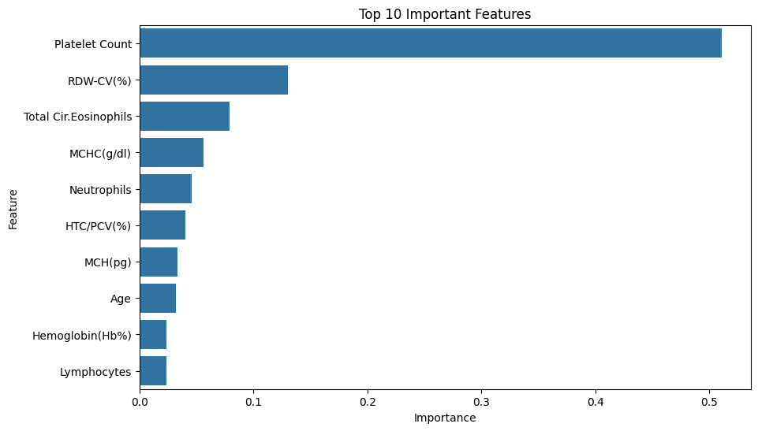
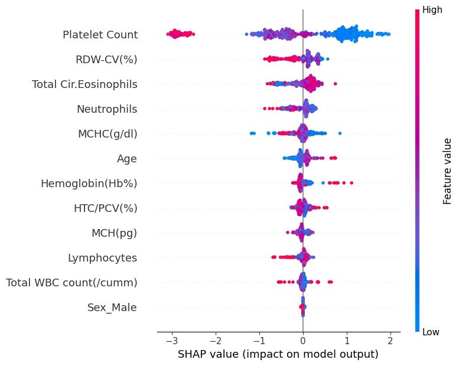

# Malaria Prediction Using Hematological Indicators

Machine Learning project for predicting malaria positivity using routinely collected hematological blood parameters.

---

# Project Objective

Malaria remains one of the leading infectious diseases globally, particularly in tropical and subtropical regions. Early diagnosis is essential for improving treatment outcomes and reducing disease burden.

This project investigates whether hematological biomarkers obtained from routine blood examinations can support malaria prediction using machine learning methods.

The study compares multiple classification algorithms, evaluates predictive performance, and explores model interpretability using SHAP (SHapley Additive Explanations).

---

# Workflow

The project includes:

- Data preprocessing and cleaning
- Exploratory Data Analysis (EDA)
- Feature engineering
- Data splitting and preprocessing
- Machine learning model development
- Model evaluation and comparison
- Feature importance analysis
- Model explainability (SHAP)
- Interactive web deployment

---

# Methodology

## Data Splitting

The dataset was divided into:

- **80% Training Set**
- **20% Testing Set**

using stratified random sampling to preserve class balance.

```python
from sklearn.model_selection import train_test_split

X_train, X_test, y_train, y_test = train_test_split(
    X,
    y,
    test_size=0.2,
    random_state=42,
    stratify=y
)
```

---

## Feature Scaling

Feature scaling was applied only to algorithms sensitive to feature magnitude.

Examples:

- Logistic Regression
- KNN
- SVM

Tree-based algorithms were trained using original feature values.

```python
from sklearn.preprocessing import StandardScaler

scaler = StandardScaler()

X_train_sc = scaler.fit_transform(X_train)
X_test_sc = scaler.transform(X_test)
```

---

# Machine Learning Models Evaluated

The following classification algorithms were implemented:

- Logistic Regression
- K-Nearest Neighbors (KNN)
- Support Vector Machine (SVM)
- Decision Tree
- Random Forest
- Gradient Boosting
- XGBoost

---

# Model Performance

| Model | Accuracy | Precision | Recall | F1-score |
|---|---:|---:|---:|---:|
| XGBoost | **76.48%** | **77.65%** | 76.48% | 76.31% |
| Gradient Boosting | **76.48%** | 77.35% | 76.48% | **76.36%** |
| Random Forest | 73.74% | 74.02% | 73.74% | 73.71% |
| SVM | 73.06% | 73.58% | 73.06% | 72.97% |
| Logistic Regression | 70.09% | 70.13% | 70.09% | 70.09% |
| KNN | 69.86% | 70.53% | 69.86% | 69.72% |
| Decision Tree | 67.35% | 67.41% | 67.35% | 67.35% |

---

# Best Performing Models

Among the evaluated algorithms, **XGBoost** and **Gradient Boosting** achieved the strongest predictive performance.

### XGBoost

- Accuracy: **76.48%**
- Precision: **77.65%**

### Gradient Boosting

- Accuracy: **76.48%**
- F1-score: **76.36%**
- ROC–AUC: **0.816**

These findings suggest that ensemble learning approaches provide stronger predictive performance than traditional classification methods for malaria prediction.

---

# ROC–AUC Analysis

The Gradient Boosting model achieved:

**ROC–AUC = 0.816**

This indicates good discriminatory performance between malaria-positive and malaria-negative cases.

---

# Features Used

## Demographic Variables

- Age
- Sex

## Hematological Indicators

- Hemoglobin (Hb%)
- Total WBC count (/cumm)
- Neutrophils
- Lymphocytes
- Total Circulating Eosinophils
- HTC/PCV (%)
- MCH (pg)
- MCHC (g/dl)
- RDW-CV (%)
- Platelet Count

---

# Feature Importance

Traditional tree-based feature importance identified:

1. Platelet Count
2. RDW-CV (%)
3. Total Circulating Eosinophils
4. MCHC (g/dl)
5. Neutrophils
6. HTC/PCV (%)

Feature importance reflects how frequently and effectively variables contributed to decision splits.

## Feature Importance Plot



---

# Model Explainability (SHAP)

To improve transparency and interpretability, SHAP (SHapley Additive Explanations) was applied.

SHAP explains how each predictor contributes to malaria predictions at both global and individual levels.

## SHAP Summary Plot



### SHAP Findings

The most influential predictors were:

1. Platelet Count
2. RDW-CV (%)
3. Total Circulating Eosinophils
4. Neutrophils
5. MCHC (g/dl)

### Interpretation

- Lower Platelet Count values increased predicted malaria risk.
- Higher RDW-CV values contributed positively to malaria prediction.
- Hematological biomarkers contributed more strongly than demographic variables.
- Sex showed minimal contribution.

The agreement between SHAP and traditional feature importance strengthens confidence in the identified predictors.

---

# Deployment

The final application was deployed as an interactive web application using:

- Gradio
- Hugging Face Spaces (Cloud Deployment)

## Live Application

https://huggingface.co/spaces/KellyChandelle/Malaria-Hematology-Predictor

Users can input hematological measurements and obtain malaria prediction results.

---

# Repository Structure

```bash
Malaria-Hematology-Predictor/
│
├── assets/
│   ├── shap_summary.png
│   ├── feature_importance.png
│   ├── roc_curve.png
│   └── app_demo.png
│
├── notebooks/
├── models/
├── app.py
├── requirements.txt
├── README.md
└── LICENSE
```

---

# Future Improvements

Potential future directions include:

- External validation on independent datasets
- Explainability comparison across models
- Integration of additional clinical variables
- Evaluation across different populations
- Extension toward real-time screening workflows

---

# Disclaimer

This project is intended for educational and research purposes only.

It should not replace laboratory testing, professional medical diagnosis, or clinical decision-making.

---

# Author

Kelly Chandelle Irumva

MSc Mathematical Sciences – Mathematical Epidemiology

Interests:

AI for Health • Machine Learning • Data Science • Disease Modeling • Predictive Analytics
